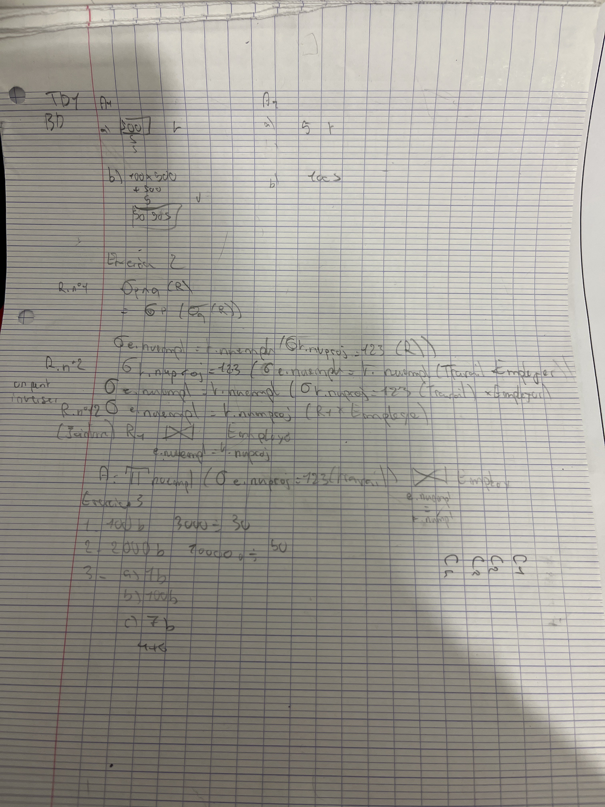

# TD1 Optimisation algébrique et physique de requêtes dans Oracle

Alexandre Clenet - Florian Tran

Année : 3

Groupe : 1-2

## Base de donnée
``Employe`` (nuempl, nomempl, hebdo,affect)

``Service`` (nuserv,nomserv,chef)

`Projet` (nuproj,nomproj,resp)

`Travail` (nuempl,nuproj,duree)

## Première Partie du TD



## Exercice 4 : Plan d’exécution de requêtes dans Oracle

### a) Collecte de statistiques

```sql
-- Collecte de statistiques sur les tables
exec dbms_stats.gather_table_stats('S5A08B', 'EMPLOYE');
```
Collecte de statistiques :
```sql
select * from user_tab_statistics;
select * from user_tab_col_statistics;
select * from user_tab_histograms;
```

### b) Création de l'histogramme

```sql
-- Création de l'histogramme sur l'attribut "hebdo" de la table "Employe"
exec dbms_stats.gather_table_stats('S5A08B', 'EMPLOYE', method_opt => 'FOR COLUMNS HEBDO');
select * from user_tab_histograms;
```
### c) Exécution de la requête Q3 et affichage du plan d'exécution

```sql
-- Exécution de la requête Q3
SELECT e.nuempl, t.duree
FROM Employe e
JOIN Travail t ON e.nuempl = t.nuempl
WHERE t.nuproj = 3;

-- Plan d'execution
select sql_id, child_number, sql_text from v$sql where sql_text 
not like '%v$sql%' and parsing_schema_name like 'S5A08B';
```
sql_id et child_number sont des identificateurs utilisés pour suivre et identifier de manière unique les exécutions de requêtes SQL dans Oracle :

    sql_id : Il est unique pour chaque exécution de requête SQL. Cela permet de suivre et d'analyser les performances et les informations liées à cette requête.

    child_number : Il représente le numéro d'enfant associé à une requête. Une même requête peut avoir plusieurs plans d'exécution possibles en fonction de différents facteurs, et chaque plan est associé à un child_number distinct.

### d) Recherche des paramètres sql_id et child_number

```sql
-- Recherche des paramètres sql_id et child_number de la requête Q3
SELECT sql_id, child_number, sql_text
FROM v$sql
WHERE sql_text LIKE '%t.duree%'
  AND sql_text NOT LIKE '%v$sql%'
  AND parsing_schema_name LIKE 'S5A08B';
```
### e) Affichage du plan d'exécution de la requête Q3

```sql
-- Affichage du plan d'exécution de la requête Q3
SELECT * FROM table(dbms_xplan.display_cursor('f52w2vurfvr3w', 0,format=>'all'));
```
### f) Utilisation de l'ordre explain plan

```sql
-- Utilisation de explain plan
EXPLAIN PLAN SET statement_id = 'ex_plan1' FOR
SELECT e.nuempl, t.duree
FROM Employe e
JOIN Travail t ON e.nuempl = t.nuempl
WHERE t.nuproj = 3;

-- Affichage du plan d'exécution
SELECT * FROM table(dbms_xplan.display(statement_id => 'ex_plan1', format => 'all'));
```
### g) Comparaison des plans d'exécution

Résultats de la comparaison entre display_cursor et explain plan : ...
## Exercice 5 : Utilisation des hints
```sql
SELECT /*+ 
    USE_NL(e t) -- Utilise Nested Loop Join
    USE_MERGE(e t) -- Utilise Merge Join
    USE_HASH(e t) -- Utilise Hash Join
*/ 
e.*, t.*
FROM Employe e
JOIN Travail t ON e.nuempl = t.nuempl;
```
## Exercice 6 : INDEX

### a) INDEX RANGE SCAN 
```sql
-- Exemple de requete
SELECT /*+ irs */ *
FROM Employe
WHERE nuempl < 1000;
```

### b) 
La différence entre TABLE ACCESS BY INDEX ROWID et TABLE ACCESS BY INDEX ROWID (BATCHED) réside dans le nombre de ROWIDs que l'opération d'accès utilise. TABLE ACCESS BY INDEX ROWID récupère une seule ROWID à la fois, tandis que TABLE ACCESS BY INDEX ROWID (BATCHED) en récupère plusieurs à la fois.

Supposons que vous vouliez accéder aux employés par leur numéro de projet en utilisant un index. Voici comment vous pourriez formuler une requête pour utiliser TABLE ACCESS BY INDEX ROWID BATCHED :
```sql
SELECT /*+ use_batched_rowid */ nuempl
FROM Travail
WHERE nuproj = :votre_numero_de_projet;
```

### h) Opérateur MERGE JOIN
```sql
-- Exemple de requete   
SELECT /*+ merge */ e.nomempl, p.nomproj
FROM Employe e
JOIN Projet p ON e.affect = p.nuproj;
```
## Exercice 7 : PL/SQL, Curseur et Plan d’exécution
```sql
-- Distribution statique
Create or replace procedure distribution_static(stat in varchar2 default NULL) as
cursor ma_requete is select id from distribution where statut=stat or statut is null;
id number(10);
cursor plan is select plan_table_output from table(dbms_xplan.display_cursor);
v_plan_table_output varchar2(1000);
begin
dbms_output.enable(1000000);
open ma_requete;
loop
fetch ma_requete into id;
exit when ma_requete%notfound;
dbms_output.put_line(id);
end loop;
close ma_requete;

dbms_output.put_line(
chr(10)||'Résultat de la requête suivante :'||
chr(10)||
chr(10)||'select id from distribution where'||
chr(10)||'(statut=stat;');
dbms_output.put_line(chr(10));
dbms_output.put_line('Plan Execution:'||chr(10));
open plan;
loop
fetch plan into v_plan_table_output;
exit when plan%notfound;
dbms_output.put_line(v_plan_table_output);
end loop;
close plan;
end;
/
```
```sql
-- Distribution dynamique
Create or replace procedure distribution_dynamique(statut in varchar2 default NULL,code in number default NULL) as

TYPE cursor_type IS REF CURSOR;
c_cursor cursor_type;

ma_requete varchar2(300);
v_id number;
v_statut varchar2(60);
v_plan_table_output varchar2(200);
cursor plan is select plan_table_output from table(dbms_xplan.display_cursor);

begin

dbms_output.enable(1000000);

ma_requete:='select id from distribution where 1 = 1';

if statut is not null then ma_requete:=ma_requete||' and statut=:statut';end if;

if code is not null then ma_requete:=ma_requete||' and ADR_NM_CP=:code';
end if;

if statut is null and code is null then
open c_cursor for ma_requete;
end if;

if statut is not null and code is null then
open c_cursor for ma_requete using statut;
end if;

if statut is null and code is not null then
open c_cursor for ma_requete using code;
end if;

if statut is not null and code is not null then
open c_cursor for ma_requete using statut,code;
end if;

loop
fetch c_cursor into v_id;
exit when c_cursor%notfound;
dbms_output.put_line(v_id);
end loop;
close c_cursor;
dbms_output.put_line(
chr(10)||'Résultat de ma requête:'||
chr(10)||
chr(10)||ma_requete);

dbms_output.put_line(chr(10)||' Plan :'||chr(10));
open plan;
loop
fetch plan into v_plan_table_output;
exit when plan%notfound;
dbms_output.put_line(v_plan_table_output);
end loop;
close plan;
end;
/
```
## Exercice 8 : Générer et analyser les plans d’exécutions des requêtes
Pour chaque requete :
```sql
-- EXEC LA REQUETE ICI

EXPLAIN PLAN FOR SELECT * FROM service s;
SELECT * FROM TABLE(DBMS_XPLAN.DISPLAY);

alter system flush shared_pool;
alter system flush buffer_cache;
```
### Sans clé primaire définie sur les tables Employe, Travail et Service
select * from service;  


select * from employe where nuempl = 17;  


select nomempl,duree from travail t, employe e where e.nuempl = t.nuempl;  


select * from employe where nuempl in (select nuempl from travail);   


select * from employe where nuempl not in (select nuempl from travail);  


select nomempl from employe e where exists (select * from travail t where t.duree > 25 and
t.nuempl=e.nuempl);


select nomempl from employe e where not exists (select * from travail t where t.duree > 25 and
t.nuempl=e.nuempl);


### Avec une clé primaire définie sur la table Employe
select * from employe where nuempl =17;


### Avec une clé primaire définie sur la table Travail
select nomempl,duree from employe e,travail t where e.nuempl = t.nuempl;


### Avec un index secondaire sur l’attribut durée de la table Travail
select nomempl from employe e, travail t where duree >25 and t.nuempl=e.nuempl


select nomserv, nomempl from service, Employe where affect = nuserv and affect = 2

