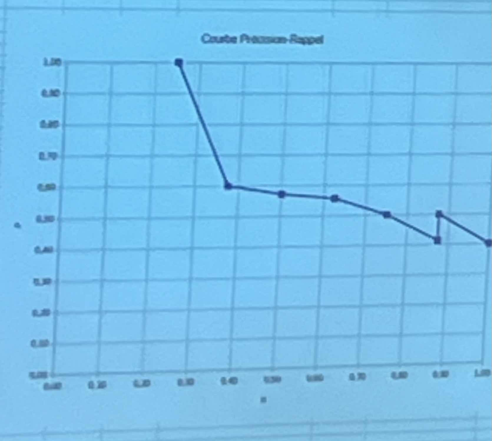

## Exercice 1 :

a:
20 données donc
12-Apprentissage 
4-validation 
4-test

b:
Fold init :
1-16 / 17-20t

Fold 1 :
1-12 / 13-16t / 17-20

Fold 2 :
1-8 / 9-12t / 13-20

Fold 3 :
1-4 / 5-8t / 9-20

Fold 4 :
1-4t / 5-20

## Exercice 2 :

a:
Moy :
Math = 87.6, Info = 78.8

Ecty : 
Math = √(((−2,6)²+(4,4)²+(0,4)²+(7,4)²+(9,6)²)÷5) = 5,885575588 
Info =  11.37

b:
norm = (X − min(X)) / (max(X) − min(X))

Math norm
1:0,411764706
2:0,823529412
3:0
4:0,588235294
5:1

Info norm
1:0,5625
2:0,90625
3:0
4:0,46875
5:1

c:
Moy :
Math = 0,564705882, Info = 0,5875

Ecty : 
Math = 0,344
Info = 0,356

## Exercice 3 :

a:
Mod 1
| Donnée              | positif  | négatif |
| :----------------   | :------: | :----:  |
| Prédiction +        | 6 | 2 |
| Prédiction -        | 0 | 2 |

précision : P = TP/(TP+FP)
0.75

rappel : R = TP/(TP+FN)
1

f-mesure : F = (2 × P × R)/(P + R)
0.86

Mod 2
| Donnée              | positif  | négatif |
| :----------------   | :------: | :----:  |
| Prédiction +        | 4 | 0 |
| Prédiction -        | 2 | 4 |

précision : P = 1

rappel : R = 0.67

f-mesure : F = 0.8

d:
Acc = (TP + TN) / (TP + FN + TN + FP)

2 modèle à 0.8 donc c'est even

## Exercice 4 :

Seuil | TP | FP | TN | FN | TFP | TTP | P | R
:----: |:----: |:----: |:----: |:----: |:----: |:----: |
0,2 |||||||
0,3 |||||||
0,4 |||||||
0,5 |||||||
0,6 |||||||
0,7 |||||||
0,8 |||||||
0,9 |||||||

Courbe Précision-Rappel

# Exercice 5

a: MacP = 0.625

b: MicP = 0.58

c: bonne précision mais 

d: MacR = 0.58  MicR = 0.58 